**Apartment for Rent in Leipzig 04299**

Apartment for rent in Leipzig 04299, available from April 1st, 2026. It’s a bright and well-kept place in a quiet residential neighborhood, while still being very well connected and close to everything you need.

The apartment is managed by a housing company. I’m simply helping to find the next tenant, ideally someone who would be happy to take over my furniture (details and prices can be discussed).

### Apartment Details:
Living space 67.20 m² with 2 rooms, 1 kitchen, 1 bathroom, 1 storage room, and 1 balcony. Practical and comfortable layout with lots of natural light. Suitable for singles or couples.

### Location & Transport:
Excellent public transport connections: 3 tram lines, 2 bus lines, and 1 S-Bahn station, all within walking distance. Green spaces and recreational areas nearby. Supermarkets and stores about 12 mins walk.

### Rent:
The current rent is 676.8 € warm (541.80 € cold plus operation cost 135.00 €). It may be adjusted due to inflation and is subject to confirmation with the management company.

### Photos:
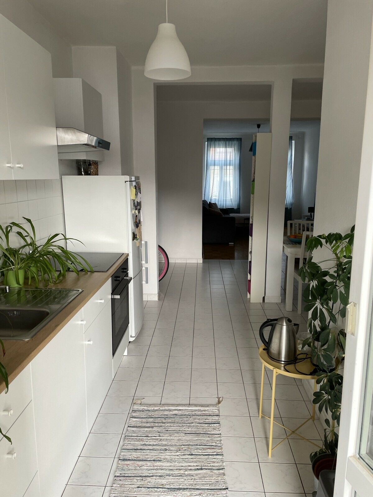
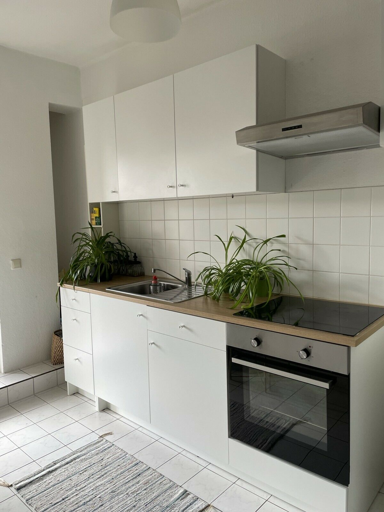
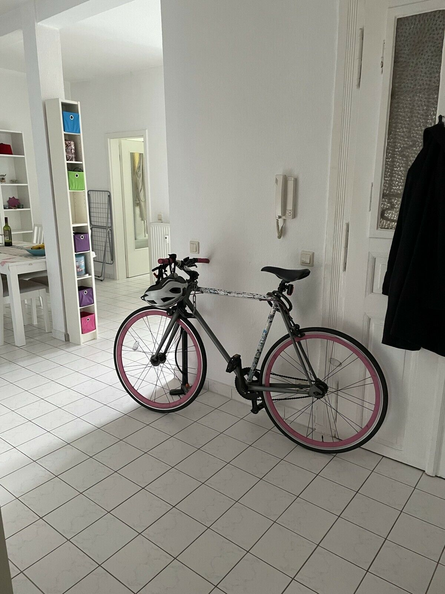
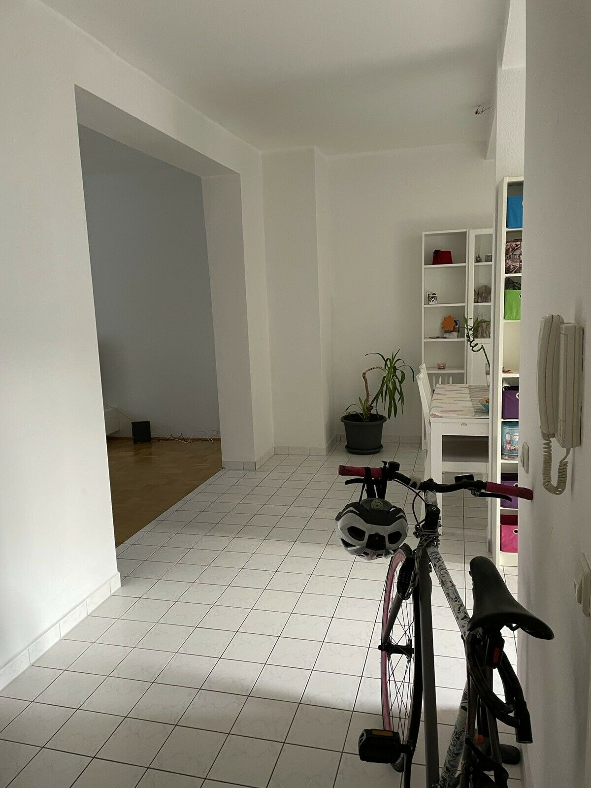
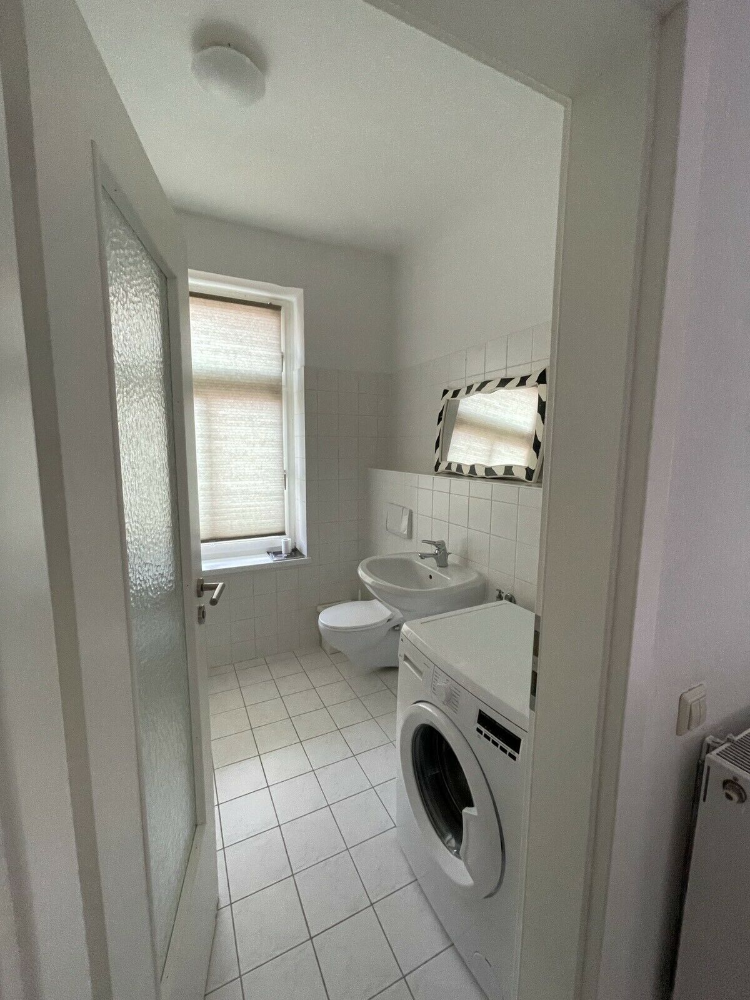
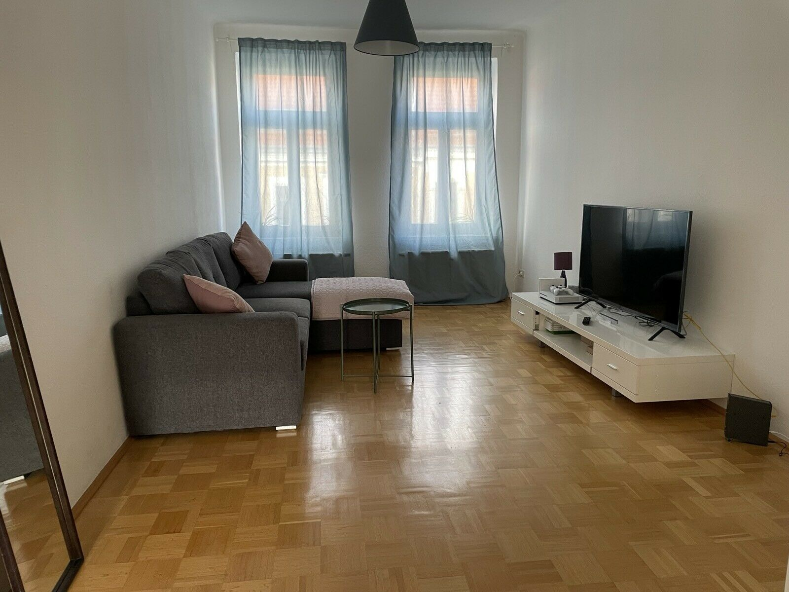
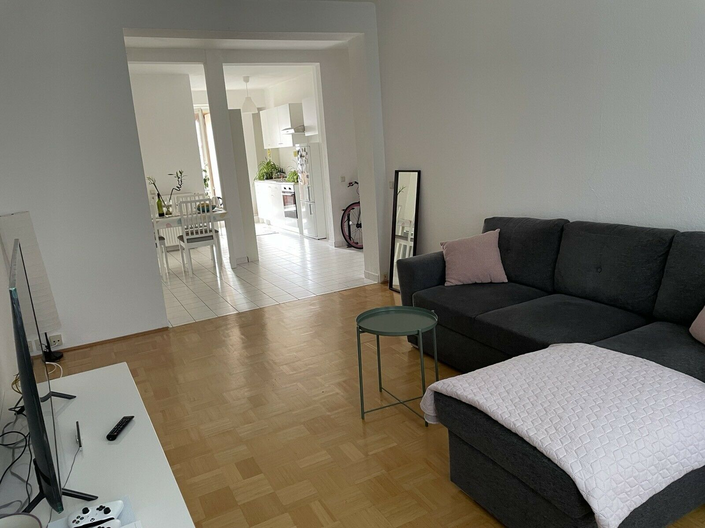
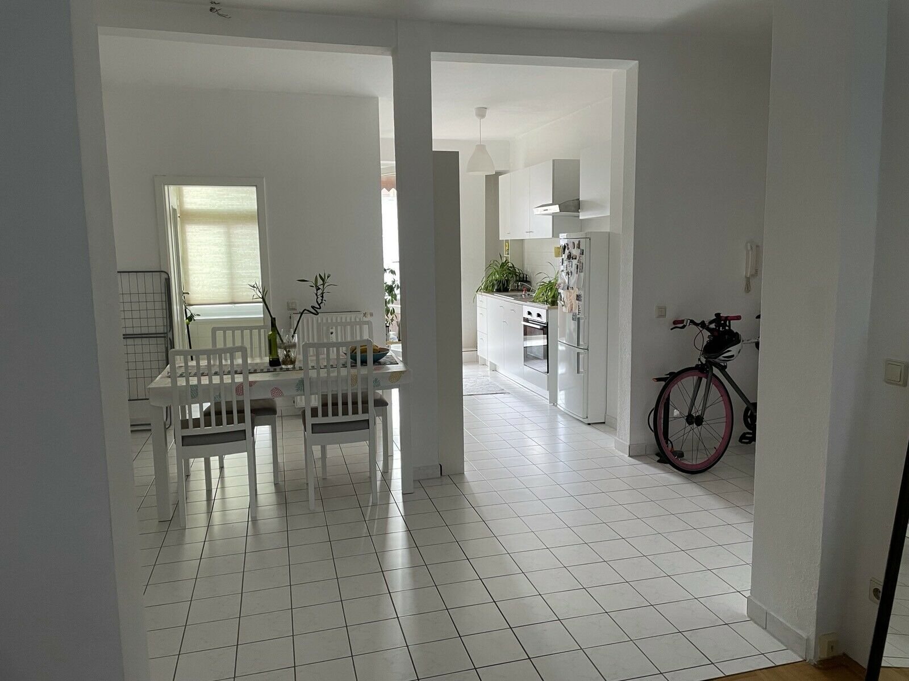
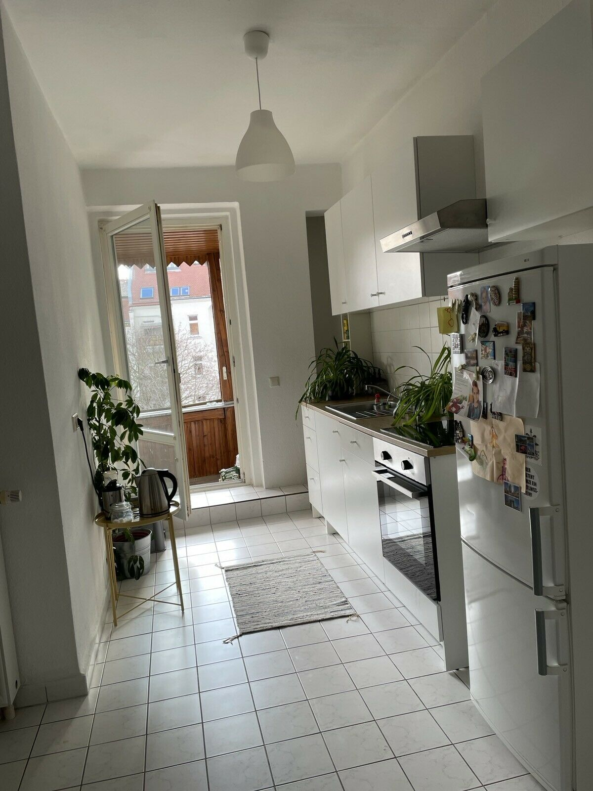
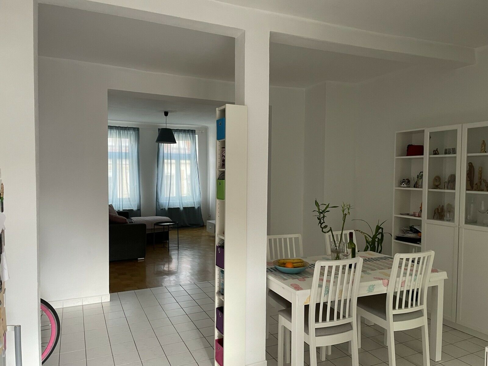
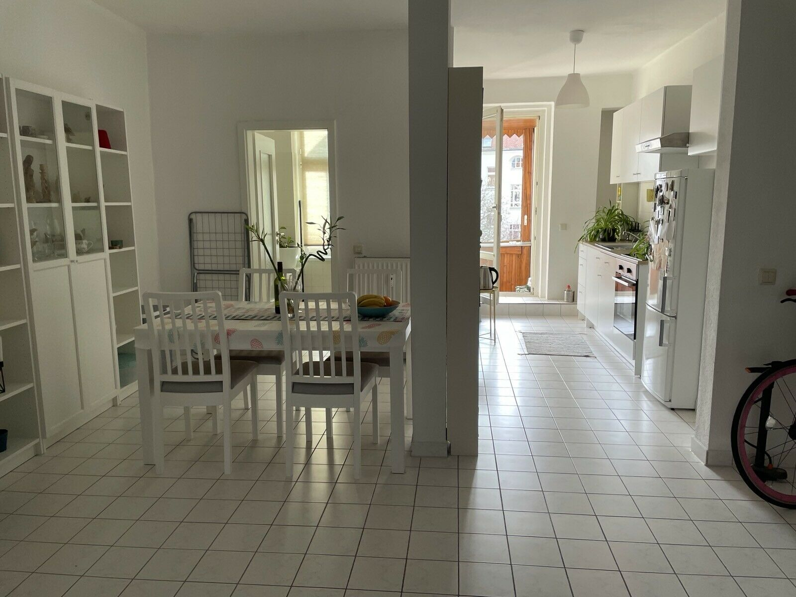
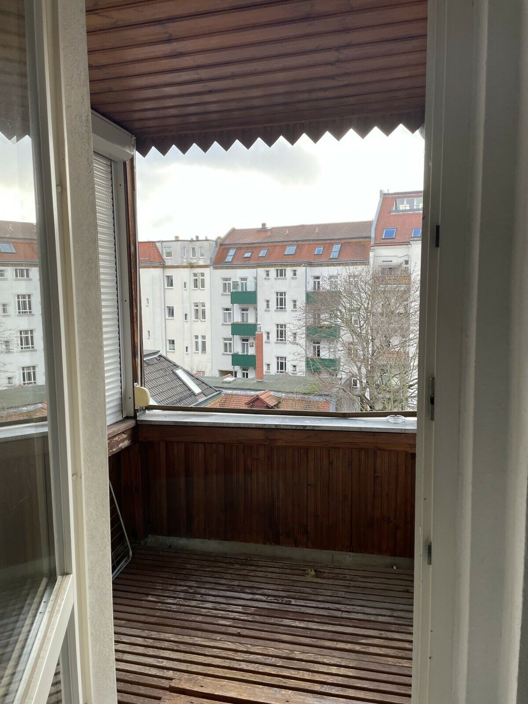

